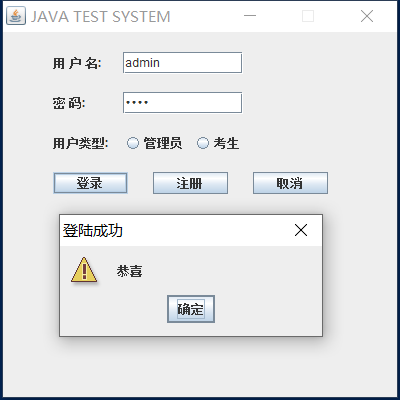
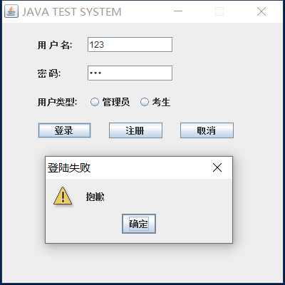
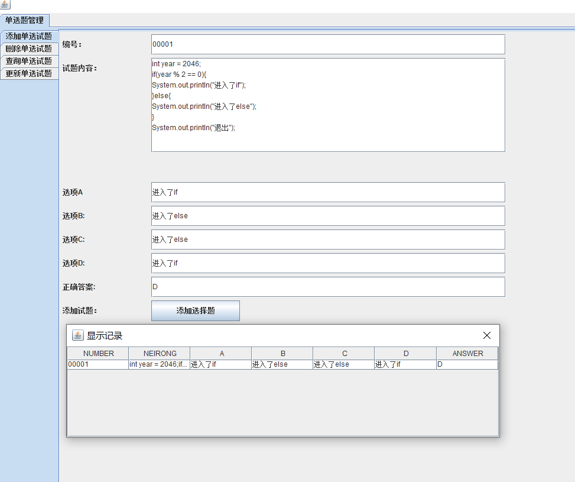
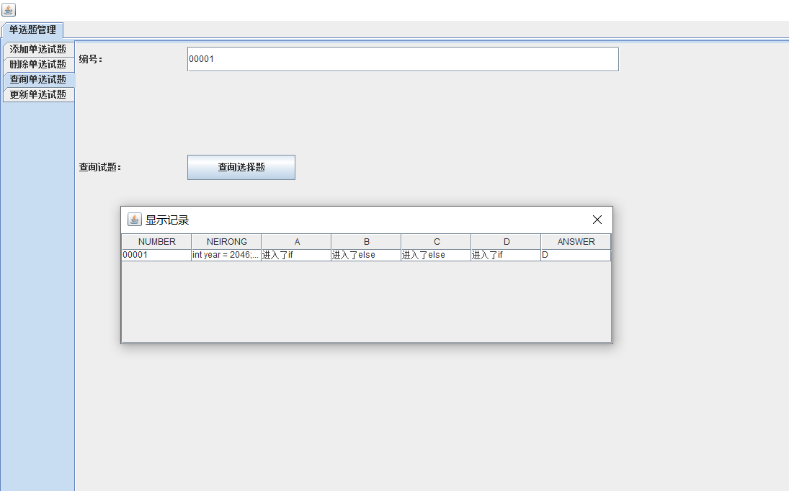
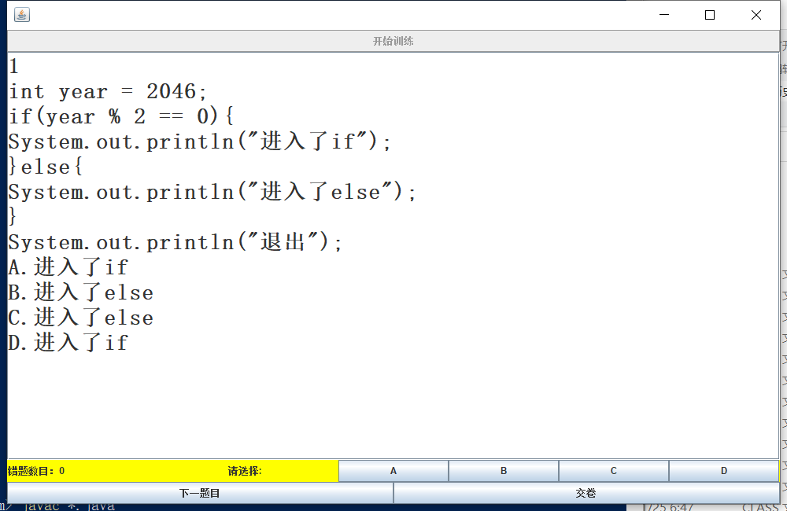
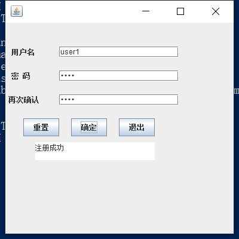

# TestSystemForJava

这是我初学JAVA时做的大作业，应该也是绝大部分学校JAVA课的大作业，在这里开源一下。

## 运行环境

###开发工具包

jdk1.8.0_40

###开发环境

Notepad++


## 主要模块

### 登录模块

### 管理后台模块

### 考试模块

### SQL预处理模块


## 使用方法
```
javac *.java
java SystemLogin
```

## 测试效果













### 登录模块

### 管理后台模块

### 考试模块

### SQL预处理模块
